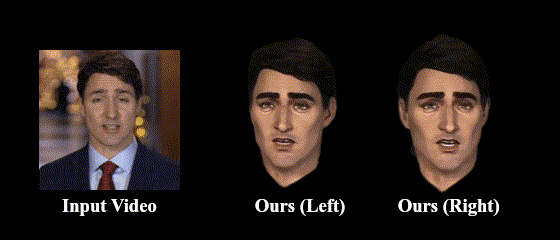
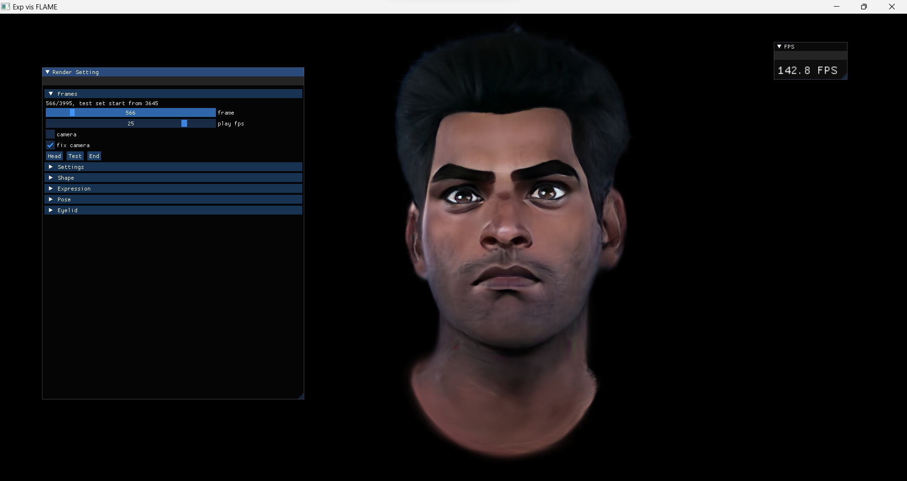

# ToonifyGB
>[arXiv](https://arxiv.org/abs/2505.10072)
>[Project](https://ruiyangju.github.io/ToonifyGB)

<p align="left">
  
</p>

## Framework
<p align="left">
  
</p>

## Citation
If you find our paper useful in your research, please consider citing:
```
  @article{ju2025toonifygb,
    title={ToonifyGB: StyleGAN-based Gaussian Blendshapes for 3D Stylized Head Avatars},
    author={Ju, Rui-Yang and Huang, Sheng-Yen and Hung, Yi-Ping},
    journal={arXiv preprint arXiv:2505.10072},
    year={2025}
  }
```

## Environment
```
  git clone --recursive https://github.com/RuiyangJu/ToonifyGB.git
  conda env create --file environment.yml
  conda activate toonifygb
```

## Dataset

<p align="left">
  
</p>

### Original Video 
* Our original videos (real head) are from [INSTA](https://github.com/Zielon/INSTA). You can access it to download them.

### Stylized Video
* You can find our generated stylized videos [here](https://1drv.ms/f/c/56c255dd1bb9ae9e/EpfvYbd5LQtDjp0aZAvLD_gBz85KRB5LIPiVF9m0EGPIzA).

### Stylized Avatar
* For stylized avatar synthesis, you can find some of our proprocessed datasets [here](https://1drv.ms/f/c/56c255dd1bb9ae9e/EtL-0jI9YhpOgsJ78yU1lZUB93gNVRQ5mx0edGymGLlIAg).

### Data Process
* We follow INSTA to process data.
If you wanna **process your own dataset**, please follow the instructions in their [repository](https://github.com/Zielon/INSTA).
You can use [Metrical Photometric Tracker](https://github.com/Zielon/metrical-tracker) to track and run `generate.sh` provided by INSTA to mask the head.
* Copy files from outputs of the tracker and INSTA's script and organize them in the following form:
  
```
<DATA_ID>
    ├── checkpoint # generated by the tracker 
    ├── images # generated by the script of INSTA
    ├── canonical.obj # generated by the tracker
```

## Training
### Stylized Video Generation

### Stylized Avatar Synthesis
* You can find some of our pre-trained models [here](https://1drv.ms/f/c/56c255dd1bb9ae9e/Eiji5bsXmmRIocx7saA8RYcBJANLmcWml6j7oTEdD41KPQ).

## FaceViewer

<p align="left">
  
</p>

* We use FaceViewer released by [GaussianBlendshapes](https://github.com/zjumsj/GaussianBlendshapes). You can also refer to GaussianBlendshapes for more information on how to use this viewer.
For Windows users, a pre-built binary is available for download [here](https://1drv.ms/u/c/56c255dd1bb9ae9e/ERR1ZtnEdqNFi7POwlFDjFUBBm0ze-9tO0a_xmYoiPTlyA?e=TQBlaM).
* If your viewer cannot start because VCOMP120.DLL is missing, you can download [vcredist](https://www.microsoft.com/en-us/download/details.aspx?id=40784) to solve this problem.
* You can use our propocessed dataset and pre-trained models to run it.
```
  cd FaceViewer
  FaceViewer_FLAME.exe --dataset DATASET_PATH/params --model MODEL_PATH
```
* If you wanna **run your own dataset and model**, you need to run script to transform dataset format first.
```
  python scripts/extract_traj.py -i DATA_PATH/checkpoint -o DATA_PATH/params
```

## Acknowledgments
This code is partially based on [GaussianBlendshapes](https://github.com/zjumsj/GaussianBlendshapes) and [StyleGANEX](https://github.com/williamyang1991/StyleGANEX).
We appreciate the authors for open-sourcing their code.


